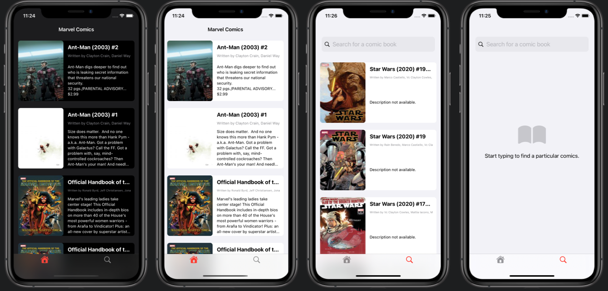

# Marvel Comics

This is an app where you can see particular Marvel comics in UITableView with custom cells. Apart from that you can search for any comic that you are interested in. Of course if there are no results for title you typed in, you will be informed about that. You can also get more details by clicking particular UITableView cell - it will open Safari window with info from Marvel.
 
 
 

### 3rd Part Libraries and other technologies:
1. SnapKit - I decided to use this library to make more elegant code for all constraints.
2. SFSymbols - I used icons from SFSymbols 3 by Apple.
3. SafariServices - I used it to make possible to display Safari inside the app itself.
4. Marvel API - I used this API to get all the data inside the app.
 

### How to install
1. You will have to get your own MarvelAPI public and private key. You also have to get your hash number (for authentication) --> Learn more: https://developer.marvel.com/documentation/authorization
2. You also have to have Cocoapods installed --> Learn more: https://cocoapods.org (Install Tab)
3. Clone this repo to your computer
4. Inside terminal change your direction to the folder with this project and type: "pod install"
5. Open Xcode
6. Go to file called "NetworkManager" and comment out one method and put your credentials to variables (follow comments in code)
7. Open project from the file with extension ".xcworkspace"
8. Choose the Simulator.
9. Hit Run button.
 

### Screenshots

